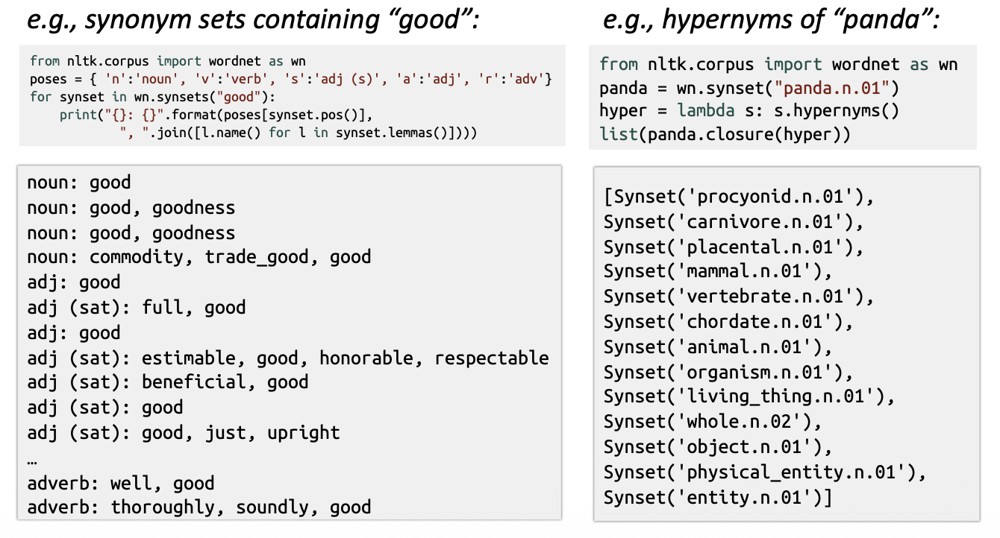

# 01 · Word Embeddings 詞嵌入 — the foundation 基礎

> **Source 出處**: CS224n Lecture 1.

---

## Contents 目錄
0. The problem: representing a word's meaning (WordNet) 如何表示詞義
1. The naive answer: one-hot vectors 獨熱編碼
2. The fix: embed into a low-dim dense space 嵌入低維稠密空間
3. One-line summary 一句話總結

---

## 0. The problem: How do we represent the meaning of a word? 如何表示詞義

The once-standard NLP solution: a hand-built resource like **WordNet** — a thesaurus of **synonym sets**
and **hypernyms** ("is-a" relationships). 早期用 WordNet 這種人工詞庫:同義詞集 + 上下位("是一種")關係。

### 0.1 Problems with WordNet 缺點
- **Misses nuance** 細微差別 — e.g. "proficient" is listed as a synonym of "good", but they aren't
  interchangeable. 同義詞其實不完全等價。
- **Misses new meanings** — can't keep up with language change. 跟不上新詞新義。
- **Subjective** and **needs human labor** to build and maintain. 主觀、需大量人力維護。
- **Can't compute word similarity** accurately. 無法準確算詞的相似度。

### 0.2 Idea: represent meaning in a Word Vector Space 用向量空間表示詞義
A model can only do math on numbers, not on the string `"cat"`. So each word must become a vector — the
question is *which* vector. 模型只能對數字做運算,不能直接算字串 `"cat"`,所以每個詞必須變成一個向量——問題是**用哪個向量**。

## 1. The naive answer: one-hot vectors 獨熱編碼

Give every word in the vocabulary its **own dimension**. With a 10,000-word vocabulary, each word is a
length-10,000 vector: `1` in its own slot, `0` elsewhere. 每個詞佔一個維度,詞典多大維度就多大。

- `cat` = `[0, 0, 1, 0, …, 0]`  (1 in position 3)
- `dog` = `[0, 1, 0, 0, …, 0]`  (1 in position 2)

This is **"one dimension per word"** — vocab size = number of dimensions. 一個詞一個維度。

### 1.1 Two fatal problems 兩個致命問題
1. **High-dimensional & sparse** 高維、稀疏 — 10,000 dims, almost all zeros. Wasteful.
2. **No sense of similarity** 無法表達相似 — any two distinct one-hot vectors are *orthogonal*, so their
   dot product is 0. Mathematically `distance(cat, dog) == distance(cat, table)`. 任意兩個詞向量都垂直、
   點積為 0 → 模型看不出「貓和狗」比「貓和桌子」更像。

## 2. The fix: embed words into a low-dim, dense space 嵌入低維稠密空間

### 2.1 The key idea: a word's meaning is its context 核心想法:分佈假說
- Represent a word by its **meaning** — and **a word's meaning is its context**, the company it keeps.
  用一個詞的上下文來定義它的意義。
- So we use the **many contexts** of a word $w$ to build up a representation of $w$. 用大量上下文,堆出 w 的表示。

> *"You shall know a word by the company it keeps."* — J.R. Firth (1957)

This **distributional hypothesis** is the shared foundation of **every** method in this course — both the
count-based ([[02-count-based-svd]]) and prediction-based ([[03-word2vec-and-glove]]) approaches. 這個
「分佈假說」是本課所有方法(計數式與預測式)的共同基礎。

### 2.2 Word vector = word embedding
An **embedding** maps each word from the huge sparse one-hot space into a much smaller **continuous**
space — typically **50 / 100 / 300** real-valued dimensions. 把每個詞從上萬維的稀疏空間,映射到一個低得多、
每維都是連續實數的稠密空間。

- `cat` ≈ `[0.21, -0.53, 0.88, …]`  (100 real numbers)
- `dog` ≈ `[0.19, -0.49, 0.91, …]`

**Goal 目標**: build a **dense** vector for each word so that words in **similar contexts** get **similar
vectors**, with similarity measured by the **dot (scalar) product**. 造稠密向量,讓上下文相似的詞向量也相似,
並以**點積**當相似度。

**Key payoff** 關鍵好處: semantically similar words end up close (high cosine similarity) — *cat* sits near
*dog*, far from *table*. That geometry is Firth's idea made computable. 語義相近的詞向量也相近,把 Firth 的
想法變成可計算的幾何。

| | One-hot | Embedding |
|---|---|---|
| Dimensions 維度 | vocab size (~10⁴) | small (50–300) |
| Values 取值 | 0 / 1 | continuous reals 連續實數 |
| Density 密度 | sparse 稀疏 | dense 稠密 |
| Encodes similarity? 表達相似? | ❌ no | ✅ yes |

> **How do we actually build these vectors?** Two families — **count** co-occurrences then compress
> ([[02-count-based-svd]]), or **learn** them by prediction with **word2vec skip-gram**
> ([[03-word2vec-and-glove]]). word2vec's **objective function** is just the "goal" above written as a
> formula: slide a window, predict each center word's context, and nudge the vectors to make the true
> context words more likely. 怎麼真正造出來?數共現再壓縮(02),或用 word2vec 預測來學(03)——後者的目標函數
> 就是把上面的「目標」寫成公式。

## 3. One-line summary 一句話總結

> A **word embedding** maps each word from a huge, sparse **one-hot** space into a small, dense, **continuous** space where **similar words get similar vectors** — trading "one dimension per word" for a geometry you can compute meaning with. 詞嵌入把獨熱的高維稀疏向量,換成低維稠密、且相似詞相近的向量。
