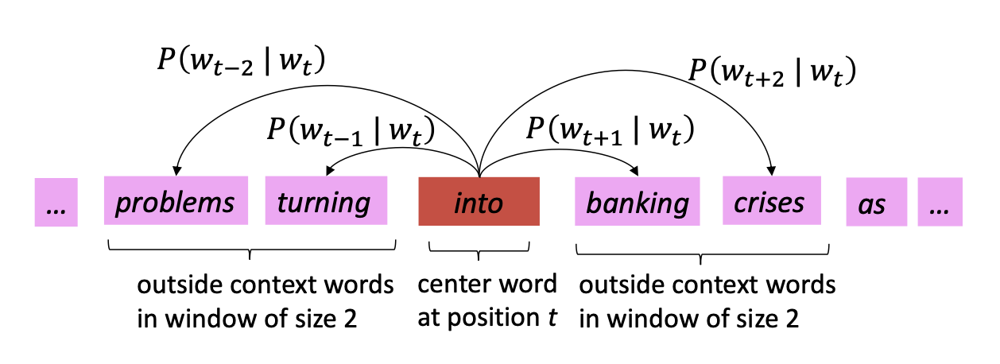

# 03 · word2vec & GloVe 詞向量 — prediction & hybrid 預測式與混合

> **Source 出處**: CS224n Lecture 2 (wordvecs2) p.10–23 · **GloVe paper**: Pennington, Socher, Manning,
> *GloVe: Global Vectors for Word Representation*, EMNLP 2014 — [pdf](https://nlp.stanford.edu/pubs/glove.pdf).

## Contents 目錄
1. word2vec (skip-gram) 預測式
2. GloVe (hybrid: count + prediction) 混合
3. word2vec vs GloVe 對照
4. One-line summary 一句話總結

## 1. Word2Vec

### 1.1 The idea 核心想法

> Review the concept in 01-word-embeddings. 

The Skip-Gram model is basically a **shallow neural network** to build the word vector space.

## 1.2 How it works 怎麼運作
Slide a window over the corpus. For each **center word**, predict its **context words** (skip-gram). Learn
the vectors that make good predictions. 滑動窗口,用中心詞預測上下文詞(skip-gram),學出好向量。

- Go through **each position** $t$: it has a **center word** $c$ and **context ("outside") words** $o$;
  score $c$↔$o$ by vector similarity, turn that into $P(o\mid c)$, and keep adjusting the vectors to make
  the true context words more likely. 每個位置有中心詞 c 與上下文詞 o,用向量相似度算 P(o|c),不斷調整讓真實上下文機率變高。
- Each word has **two vectors**: $v_w$ as center, $u_w$ as context (easier optimization; average at the end).
  每個詞有兩個向量:當中心詞 $v_w$、當上下文 $u_w$。
- Variant 變體: **CBOW** predicts the center word from context (the reverse). skip-gram 的反向是 CBOW。

## 1.3. Mathmology (Optional)
### 1.3.1 The prediction: $P(o\mid c)$ 單一預測機率
For every **center word** $c$, skip-gram wants to give **high probability to its true context words** $o$.
Do that at every position in the corpus → good vectors. 對每個中心詞,把真正的上下文詞機率調高。

#### 1.3.1.1 Probability 機率
$P(o\mid c)$ = "given center word $c$, how likely is word $o$ in its context?" Score a (center, context)
pair by the **dot product** $u_o^\top v_c$: bigger dot product = more similar = should be more likely.
用兩個向量的**點積**當相似度分數,越像機率越高。

#### 1.3.1.2 Softmax
Normalize those dot-product scores over the **whole vocabulary** so they sum to 1:
$$P(o\mid c)=\frac{\exp(u_o^\top v_c)}{\sum_{w\in V}\exp(u_w^\top v_c)}$$
Numerator = the real pair's score; denominator = sum over **all** words (the normalizer). 分子是真配對,
分母對全詞典正規化。 ⚠️ that denominator is exactly what makes it **expensive** → fixed by §1.5. 分母很貴。

### 1.3.2 Likelihood → objective function $J(\theta)$ 似然 → 目標函數
Each position gives one $P(o\mid c)$; the model's job is to make **all** of them high **at once**.
每個位置給一個 P(o|c),要讓它們同時都高。

**Step 1 — Likelihood 似然.** Multiply that probability over every center position $t=1\dots T$ and every
window offset $j$ (skip $j=0$, the center itself):
$$L(\theta)=\prod_{t=1}^{T}\ \prod_{\substack{-m\le j\le m\\ j\ne 0}} P(w_{t+j}\mid w_t;\theta)$$
$\theta$ = **all** the parameters (the $u$ and $v$ vectors of every word). Good vectors → true context words
get high probability → $L(\theta)$ large, so we want to **maximize** it. θ 是所有詞的 u、v;向量學得好,真實
上下文機率高,L(θ) 就大 → 要最大化。

> **Example — window $m=2$, center `into`** 例子:
> `… problems turning [into] banking crises …`
> this one position contributes the **inner product** `P(problems|into)·P(turning|into)·P(banking|into)·P(crises|into)`;
> the **outer** $\prod$ repeats that for every center word and multiplies them all. 內層 ∏ 是一個中心詞的
> 4 個上下文機率相乘,外層 ∏ 把每個中心詞都這樣算再全部相乘。

**Step 2 — turn $L$ into the objective $J$.** We don't optimize $L$ directly; three moves fix it:

| move 動作 | why 為什麼 |
|---|---|
| **take log** | product ∏ → sum ∑ ($\log$ turns × into +); avoids underflow from multiplying millions of probabilities < 1. 連乘變連加,避免下溢。 |
| **negate (−)** | optimizers **minimize**, so flip the sign: $\max L \Leftrightarrow \min(-\log L)$. 加負號,把最大化變最小化。 |
| **average (1/T)** | divide by corpus length $T$ so the value doesn't grow with the corpus — pure scaling, same optimum. 除以 T,與語料長度無關。 |

The result is the **objective** (a.k.a. cost / loss) function to **minimize**:
$$J(\theta)=-\frac{1}{T}\log L(\theta)=-\frac{1}{T}\sum_{t=1}^{T}\ \sum_{\substack{-m\le j\le m\\ j\ne 0}}\ \log P(w_{t+j}\mid w_t;\theta)$$

> **Minimizing $J(\theta)$ ⟺ maximizing predictive accuracy** — the same thing, opposite sign. 最小化 J
> = 最大化對上下文的預測準確度,同一件事。

> **Is skip-gram a "bag of words" model? 是「詞袋」模型嗎?** **Yes — inside the window.** $P(o\mid c)$ uses the
> **same** formula whether $o$ sits one word to the left, one to the right, or two away: it only cares
> **which** words co-occur, **not their order or position**. Ignoring position *within the window* is
> exactly what "bag of words" means. 窗口內不管詞的位置與順序,只看「有哪些詞」,所以是詞袋。

## 1.4 Negative sampling — what word2vec actually uses 負採樣
**Problem 問題**: the softmax denominator sums over the **whole vocabulary** $V$ — huge and slow. 分母太貴。

Instead of softmax, turn it into **binary logistic regressions**: push the true (center, context) pair
**up**, push $K$ random "noise" pairs **down**. 把它變成二元分類:真的配對推高,K 個隨機配對壓低。
$$J_{\text{neg}}=-\log\sigma(u_o^\top v_c)-\sum_{k=1}^{K}\log\sigma(-u_k^\top v_c)$$
- $\sigma$ = sigmoid (not softmax). 用 sigmoid,不是 softmax。
- Negatives drawn from $P(w)=U(w)^{3/4}/Z$ — the unigram distribution to the 3/4 power, so rarer words get
  sampled a bit more. 3/4 次方讓罕見詞多被抽一點。
- Gradients are **sparse**: each window only touches $2m+1$ real words + $Km$ negatives. 梯度稀疏。

## 2. GloVe (hybrid: count + prediction) 混合

### 2.1 The insight — ratios of co-occurrence probabilities 關鍵洞見:共現機率的比值
Meaning is encoded not in raw counts, but in the **ratio** $P(x\mid \text{ice})/P(x\mid \text{steam})$:

| x | ratio $P(x\mid ice)/P(x\mid steam)$ | meaning 語義 |
|---|---|---|
| solid 固體 | **large 大** | relates to ice, not steam |
| gas 氣體 | **small 小** | relates to steam, not ice |
| water 水 | ≈ 1 | related to both 都有關 |
| fashion 時尚 | ≈ 1 | related to neither 都無關 |

The "large / small / ≈1" pattern captures the **solid–gas** meaning axis. 這個比值抓到「固態 vs 氣態」的語義維度。

### 2.2 Log-bilinear model 對數雙線性模型
GloVe designs vectors so their **dot product ≈ log co-occurrence count**:
$$w_i^\top w_j + b_i + b_j \approx \log X_{ij}$$
Then **vector differences capture the ratios** → meaning becomes linear directions (enables analogies
`king − man + woman ≈ queen`). 於是向量相減對應比值,語義變成線性方向。

### 2.3 From ratio to log-count — the derivation 從比值到 log 次數(optional)
GloVe does **not** optimize the ratio directly. It uses an algebra trick to turn "ratio of probabilities"
into "dot product of vectors". GloVe 不直接優化比值,而是把比值轉成點積。

1. Want a function $F$ of the vectors to equal the ratio:
   $$F(w_i, w_j, w_k) = \frac{P(k\mid i)}{P(k\mid j)}$$
2. Compare $i,j$ with a **vector difference**, and reduce to a scalar with a **dot product**:
   $$F\big((w_i-w_j)^\top w_k\big) = \frac{P(k\mid i)}{P(k\mid j)}$$
3. Pick $F=\exp$, because it turns **subtraction into division** 把減法變除法:
   $$\exp\big((w_i-w_j)^\top w_k\big)=\frac{\exp(w_i^\top w_k)}{\exp(w_j^\top w_k)}=\frac{P(k\mid i)}{P(k\mid j)}$$
4. So it suffices that $\exp(w_i^\top w_k)=P(k\mid i)$, i.e. take $\log$:
   $$w_i^\top w_k=\log P(k\mid i)=\log X_{ik}-\log X_i$$
5. $\log X_i$ is independent of $k$ → absorb into a bias $b_i$ (add $b_k$ for symmetry):
   $$w_i^\top w_k+b_i+b_k=\log X_{ik}$$

**Punchline 重點**: the ratio never appears in the final objective — it fits dot products to `log X`. But
because of the derivation, fitting log-counts **automatically** makes
$\log\frac{P(k\mid i)}{P(k\mid j)}=(w_i-w_j)^\top w_k$, so the **ratio is encoded in the vector
difference**. That is why analogies work. 比值被藏進「向量差」,所以能做類比。

### 2.4 The loss 損失函數
$$J=\sum_{i,j} f(X_{ij})\,\big(w_i^\top w_j + b_i + b_j - \log X_{ij}\big)^2$$
- $X_{ij}$ = global co-occurrence count of word $j$ in word $i$'s context. 全域共現次數。
- **Fast training, scalable to huge corpora** — trains on the nonzero entries of $X$. 只算非零項,快、可擴展。

## 3. word2vec vs GloVe 對照

| | word2vec (skip-gram) | GloVe |
|---|---|---|
| Base | prediction / neural | hybrid |
| Data | local windows, one at a time 局部窗口 | global co-occurrence matrix 全域矩陣 |
| Learns by | predicting context (neg. sampling) 預測 | fitting dot product to log-counts 擬合對數次數 |
| Loss | $-\log\sigma(u_o^\top v_c)-\sum_k\log\sigma(-u_k^\top v_c)$ | $\sum f(X_{ij})(w_i^\top w_j+b_i+b_j-\log X_{ij})^2$ |
| Uses global stats? | ✗ (iterates corpus) | ✓ |
| Speed | scales with corpus size | fast, scales with nonzeros |
| Performance | comparable; GloVe slightly better on some tasks (e.g. NER) 差不多,GloVe 某些任務略勝 |

## 4. One-line summary 一句話總結

> **word2vec** learns embeddings by *predicting* context with a neural objective (skip-gram + negative
> sampling). **GloVe** starts from *global co-occurrence counts* and *learns* vectors whose dot products
> match log-counts, so it combines count-based statistics with predictive learning.
> word2vec 用神經預測學向量;GloVe 從全域共現統計出發、用學習擬合對數次數,結合了計數與預測兩者的優點。