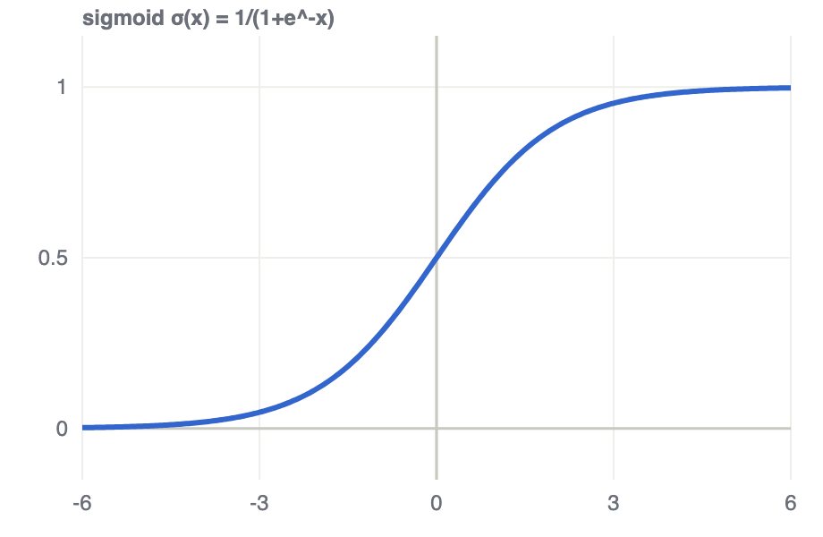
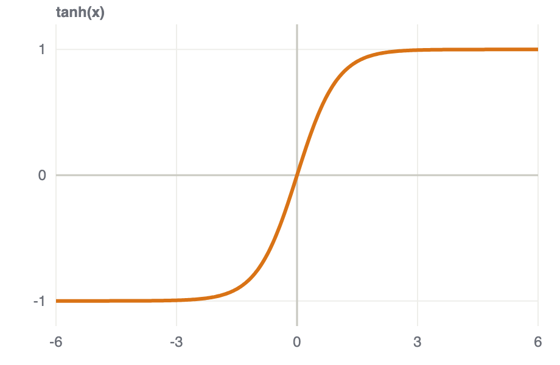
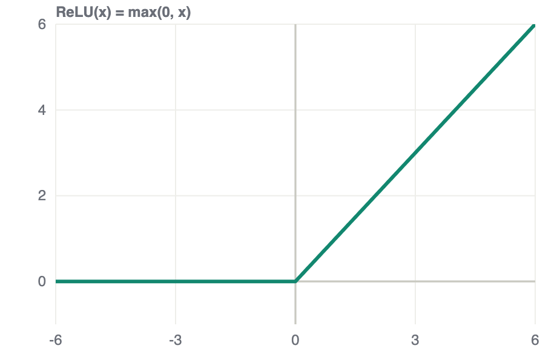

# 04 · Neural-Net Classifiers: NER & Non-linearities 神經網路分類器

> **Source 出處**: CS224n Lecture 3 (neural nets & word-window classification).

## Contents 目錄
1. NER — Named Entity Recognition 命名實體辨識
2. ⭐ Why non-linearities 為什麼要非線性
3. One-line summary 一句話總結

## 1. NER — Named Entity Recognition 命名實體辨識

### 1.1 What & why 是什麼、為什麼
**NER = label each word with its entity type** — Person / Location / Organization / Date / … (or "none").
給每個詞標上實體類別(人/地/組織/…)。 It's the classic **information-extraction** task: turn free text
into structured facts (who, where, when). 從自由文本抽出結構化資訊。

> **"Paris** Hilton" (Person) vs "flew to **Paris**" (Location) — same word, different entity. The
> **context decides**, so we can't classify a word in isolation. 同一個詞靠上下文決定實體,不能單看它。

### 1.2 Window classification 窗口分類 (how CS224n frames it)
To classify a word, take a **window** of its neighbours, **concatenate** their word vectors into one
long vector, and feed that to a classifier. 把中心詞和左右鄰居的向量接成一條,再丟進分類器。

- Input 輸入 (window = ±2): `x = [ v(flew) ; v(to) ; v(Paris) ; v(next) ; v(week) ]`. 拼接鄰居向量。
- The neighbours supply the **context** needed to disambiguate the center word. 鄰居提供消歧的上下文。
- A plain **linear** classifier on `x` is weak (only straight-line boundaries) → we want a **neural net**
  → which is only worth it because of **non-linearities** (§2). 線性分類器不夠力,所以用神經網路,而它的關鍵是非線性。

---

## 2. ⭐ Why non-linearities 為什麼要非線性

### 2.1 The problem: stacked linear layers collapse 疊線性層會塌成一層
One layer is `Wx+b`. Stack two **without** anything between them:
$$W_2\,(W_1x+b_1)+b_2 \;=\; (W_2W_1)\,x + (W_2b_1+b_2) \;=\; W'x + b'$$
Two linear layers = **one** linear layer. 沒有非線性,兩層等於一層。 So a "deep" linear network is **no
more expressive** than a single linear layer — it can still only carve **straight-line / hyperplane
decision boundaries**. 疊再多層也只能畫直線邊界。

### 2.2 The fix: a non-linear activation between layers 層間加一個非線性
Insert a non-linear function $f$ (sigmoid / tanh / **ReLU**):
$$h = f(W_1x+b_1),\qquad \hat y = W_2h+b_2$$
Now the layers **don't collapse**, and the network can **bend** the decision boundary — it represents
**non-linear** functions. 加了 $f$ 就不會塌,能學彎曲的邊界。

- **Universal approximation** 萬能逼近: with a non-linearity and enough hidden units, a network can
  approximate **any** continuous function. 有非線性 + 夠多隱藏單元 → 可逼近任意函數。
- **ReLU** $=\max(0,x)$ is today's default — cheap to compute and avoids the **vanishing gradients** that
  sigmoid/tanh suffer from. ReLU 便宜、又避免梯度消失,現在的預設。

### 2.2.1 The three Non-linear activations 三個常見激活函數的圖形

| sigmoid | tanh | ReLU |
|:---:|:---:|:---:|
|  |  |  |
| range (0, 1) | range (−1, 1), zero-centered | range [0, ∞), hinge at 0 |
| $\dfrac{1}{1+e^{-x}}$ | $\dfrac{1}{1+e^{-x}}$ | $=\dfrac{1}{1+e^{-x}}$ | 

- **sigmoid**  — squashes to **(0, 1)**; both tails go flat → **vanishing gradients**; output looks like a probability, so it lives in the **final layer**. 壓到 (0,1),兩端平坦會梯度消失,常放輸出層。
- **tanh** — same S-shape but **(−1, 1)** and **zero-centered** (passes through the origin), which trains
  better than sigmoid in hidden layers; still saturates at the tails. 形同但過原點、值域 (−1,1),比 sigmoid 好但仍會飽和。
- **ReLU** $=\max(0,x)$ — a **hinge**: kills negatives, passes positives unchanged. No positive-side
  saturation + dead-cheap → the **default hidden-layer** choice. 折角:負的砍成 0、正的原樣通過,不飽和又便宜,隱藏層預設。

> **One-liner 一句話**: non-linearities are **what make depth mean anything**. Without them, stacking
> layers is pointless — the whole net is just one linear map. 沒有非線性,疊層毫無意義,整個網路只是一個線性映射。

## 3. One-line summary 一句話總結

> **NER** classifies each word's entity type from its **context window** (concatenated neighbour vectors);
> doing it well needs a **neural net**, and a neural net only beats a linear model because of the
> **non-linear activations** between its layers — otherwise every layer collapses into one.
> NER 用上下文窗口分類實體;要用神經網路,而神經網路的威力來自層間的**非線性**(否則多層等於一層)。
