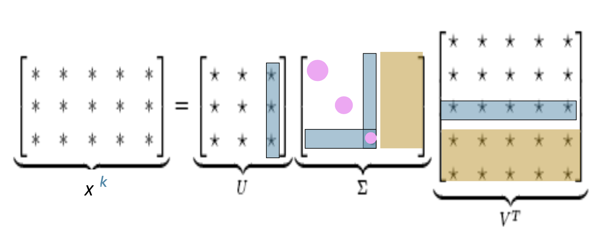

# SVD & Dimensionality Reduction 奇異值分解與降維 (incl. Eigenvalues)

> **Use 用途**: math core of Assignment 1 · Q1.3 `reduce_to_k_dim` — compress a high-dim
> co-occurrence matrix into low-dim word vectors. 把高維共現矩陣壓成低維詞向量。
> **Related 關聯**: [[word-embeddings]]
> **How to read 讀法**: §1–§2 basics → **§3–§4 the core (theorem + meaning)** → §6 how to compute → §7–§8 code.

---

## Contents 目錄
1. One-line overview 總覽
2. Prerequisite: Eigenvalues 前置:特徵值
3. The SVD theorem 定理 $A=USV^T$ (§3.1 why it works 推導)
4. ⭐ Physical meaning of U / S / V 三矩陣的物理意義
5. Geometric intuition 幾何直覺
6. Compute S + worked example 怎麼算 S + 手把手例子
7. Truncated SVD 截斷降維
8. a1 code a1 程式碼 (§8.1 `n_iter`)
9. One-line summary 一句話總結

---

## 1. One-line overview 總覽

**SVD factors any matrix $A$ into three matrices**, exposing its "most important directions" so we
can reduce dimensions. 把任意矩陣拆成三個,找出「最重要的方向」來降維。

$$A_{m\times n} = U_{m\times m}\; S_{m\times n}\; V^T_{n\times n}$$

---

## 2. Prerequisite: Eigenvalues 前置:特徵值

### 2.1 Definition 定義
For a **square** matrix $A$, if $A\vec{v}=\lambda\vec{v}$ for some nonzero $\vec{v}$ and scalar
$\lambda$, then $\lambda$ is an **eigenvalue** and $\vec{v}$ an **eigenvector**.

**Intuition 直覺**: a matrix usually rotates *and* stretches a vector; but along an eigenvector it
**only stretches, no direction change** — the stretch factor is $\lambda$. 只拉伸不轉向,倍數就是 $\lambda$。

### 2.2 The characteristic equation 特徵方程
$$(A-\lambda I)\vec{v}=0 \;\Rightarrow\; \boxed{\det(A-\lambda I)=0}$$
Solve for $\lambda$, then back-substitute for $\vec{v}$. 解出 $\lambda$ 再求 $\vec v$。

### 2.3 Example 例子 (2×2)
$$A=\begin{pmatrix}2&1\\1&2\end{pmatrix}\Rightarrow(\lambda-1)(\lambda-3)=0\Rightarrow\lambda=3,\vec v=(1,1);\;\lambda=1,\vec v=(1,-1)$$

### 2.4 Code 程式碼
```python
import numpy as np
np.linalg.eig(A)    # general square matrix 一般方陣
np.linalg.eigh(A)   # symmetric — faster & stabler 對稱陣,更快更穩
```

---

## 3. The SVD theorem 定理: $A = U S V^T$

For **any** $m\times n$ matrix $A$, the factorization $A=U_{m\times m}\,S_{m\times n}\,V^T_{n\times n}$
exists with:

- $U^TU=I$, $V^TV=I$ — $U, V$ are **orthogonal** (columns are perpendicular unit vectors). 正交矩陣。
- Columns of $U$ = **orthonormal eigenvectors of $AA^T$**. U 的列是 $AA^T$ 的正交特徵向量。
- Columns of $V$ = **orthonormal eigenvectors of $A^TA$**. V 的列是 $A^TA$ 的正交特徵向量。
- $S$ = **diagonal**, singular values $\sigma_i=\sqrt{\lambda_i}$ in descending order. S 對角,奇異值由大到小。

### 3.1 Why it works — where U and σ come from 推導

The bullets above are **not definitions** — they fall out of one calculation. 不是硬定義,是推導掉出來的。

**Idea 想法**: assume $A=USV^T$ exists, compute $AA^T$, and watch $V$ cancel.

$$AA^T = (USV^T)(USV^T)^T = US\underbrace{(V^TV)}_{=\,I}S^TU^T = U\,(SS^T)\,U^T$$

**Compare the spectral theorem** 對照譜定理: any **symmetric** $M$ diagonalizes as $M=Q\Lambda Q^T$,
with $Q$'s columns = orthonormal eigenvectors, $\Lambda$ = eigenvalues. Match term-by-term:

$$\underbrace{AA^T}_{M} = \underbrace{U}_{Q}\,\underbrace{(SS^T)}_{\Lambda}\,\underbrace{U^T}_{Q^T}$$

1. **$U$** = orthonormal eigenvectors of $AA^T$. Orthonormal is *guaranteed* because $AA^T$ is
   symmetric ($(AA^T)^T=AA^T$) — orthogonality is a gift of symmetry, not forced. 對稱⇒正交是保證的。
2. **$\sigma_i=\sqrt{\lambda_i}$**: matching the middle, $SS^T=\Lambda$. $S$ diagonal with $\sigma_i$
   $\Rightarrow$ $SS^T$ diagonal with $\sigma_i^2$ $\Rightarrow$ $\sigma_i^2=\lambda_i$. 平方成特徵值,開根號還原。
3. Likewise $A^TA=V(S^TS)V^T$ ($U^TU$ cancels) $\Rightarrow$ **$V$** = eigenvectors of $A^TA$, same $\lambda$.

**Check with §6** 驗證: $AA^T=\begin{pmatrix}17&8\\8&17\end{pmatrix}$ has $\lambda=25,9$ →
$\sigma=\sqrt{25},\sqrt9=5,3$ ✅

---

## 4. ⭐ Physical meaning of U / S / V 三矩陣的物理意義

Take a1's **co-occurrence matrix**: $A$ is `word(row) × context(col)`. Think of SVD as **discovering
hidden latent topics between words and contexts**. 在詞和上下文之間,挖出隱藏的「語義主題」。

| Matrix | Shape | Physical meaning 物理意義 |
|--------|-------|------|
| **$U$** | m×m | **word ↔ topic** 詞↔主題. Column = a latent topic axis; row = how strongly *that word* loads on each topic. $U$ alone = **direction only**. U 只給方向。 |
| **$S$** | m×n | **importance of each topic** 每個主題的重要度. Bigger $\sigma_i$ = more prominent / more info; smaller ≈ noise. |
| **$V$** | n×n | **context ↔ topic** 上下文↔主題. Same topics, from the context side. 同一批主題在上下文側。 |

**⚠️ The word vector is a row of $U\cdot S$, NOT of $U$ alone. 詞向量是 $U\cdot S$ 的列。**
> $U$ gives direction; $\times S$ scales each axis by that topic's importance ($\sigma_i$). Kirk
> Baker's tutorial computes word similarity on rows of **$US$** (contexts on rows of $VS$). That's
> why a1's `reduce_to_k_dim` docstring says it "actually returns **U * S**". 相似度在 $US$ 的列上算。

**Linking sentence 串起來**: $U$ and $V$ are the **same latent topics** on the word side vs the
context side; $S$ is each topic's **weight**. → a three-layer **word — topic — context** structure.

**Abstract view (any $A$ as a linear map) 通用理解**: columns of $V$ / $U$ = orthogonal principal
directions of the **input** / **output** space; $S$ = stretch factors between them.

---

## 5. Geometric intuition: rotate → stretch → rotate 幾何直覺

Read $USV^T\vec x$ right-to-left 從右往左讀:

$$\vec{x} \xrightarrow{\;V^T\;} \text{rotate to principal axes} \xrightarrow{\;S\;} \text{stretch by }\sigma_i \xrightarrow{\;U\;} \text{rotate to output space}$$

A unit circle mapped by $A$ becomes an **ellipse**: semi-axis **lengths = $\sigma_i$**, semi-axis
**directions = columns of $U$**. 單位圓→橢圓:半軸長=奇異值,方向=U 的列。
This is *why* a big singular value = more info: it's the direction stretched most. 拉最長=資訊最多。

---

## 6. Compute S + worked example 怎麼算 S + 手把手例子

**Recipe 配方**: ① form $A^TA$ (or $AA^T$) ② eigenvalues $\lambda_1\ge\dots\ge0$ ③ $\sigma_i=\sqrt{\lambda_i}$
④ put on the diagonal of an $m\times n$ zero matrix, largest first. **$S$ is $m\times n$, not square.**

**Example (numpy-verified)**:
$$A=\begin{pmatrix}3&2&2\\2&3&-2\end{pmatrix}\quad(m=2,\,n=3)$$

**① $AA^T$** (use the 2×2 side since m<n):
$$AA^T=\begin{pmatrix}17&8\\8&17\end{pmatrix}$$

**② Eigenvalues** (for $\begin{pmatrix}a&b\\b&a\end{pmatrix}$ they are $a\pm b$): $\lambda_1=25,\lambda_2=9$.

**③ Singular values → S**:
$$\sigma_1=5,\;\sigma_2=3\;\Rightarrow\;\boxed{S=\begin{pmatrix}5&0&0\\0&3&0\end{pmatrix}}$$

**④ U** (orthonormal eigenvectors of $AA^T$): $U=\tfrac{1}{\sqrt2}\begin{pmatrix}1&1\\1&-1\end{pmatrix}$

**⑤ V** (shortcut $v_i=A^Tu_i/\sigma_i$): $v_1=\tfrac{1}{\sqrt2}(1,1,0),\; v_2=\tfrac{1}{3\sqrt2}(1,-1,4),\; v_3=\tfrac13(2,-2,-1)$

**⑥ Code check 驗證**:
```python
import numpy as np
A = np.array([[3,2,2],[2,3,-2]], float)
U, s, Vt = np.linalg.svd(A)          # s = [5., 3.]  ← 1-D array of singular values, NOT the m×n matrix
S = np.zeros_like(A); np.fill_diagonal(S, s)
print(np.allclose(A, U @ S @ Vt))    # True
```

---

## 7. Truncated SVD 截斷降維



Keep only the largest $k$ singular values and their columns: 只保留最大的前 k 個:

$$A \approx U_k\,S_k\,V_k^T$$

- Reduced word vector = row of $U_k S_k$ (**m×k**) — each word uses only $k$ numbers. sklearn's
  `fit_transform` returns exactly this $U\!\cdot\!S$. 降維後詞向量 = $U_k S_k$ 的列。
- Dropped small-$\sigma$ directions ≈ noise; large-$\sigma$ topics kept. 丟噪音留主題。
- Same essence as **PCA**: keep max-variance directions and project. 與 PCA 同本質。
- **Why semantics survive** 語義為何還在: kept topics encode "which words share contexts", so
  *doctor–hospital* stay close, *doctor–dog* stay far → the dense, similarity-aware [[word-embeddings]].

---

## 8. a1 code a1 程式碼 (Q1.3)

```python
from sklearn.decomposition import TruncatedSVD
svd = TruncatedSVD(n_components=k, n_iter=10)
M_reduced = svd.fit_transform(M)   # (num_words, num_words) -> (num_words, k)
```

- Computes only the top $k$ components — faster & lighter than full SVD. 只算前 k 個,省時省記憶體。
- `fit_transform` returns $U\cdot S$ (the word vectors), shape `(num_words, k)`. 回傳 $U\!\cdot\!S$。
- **Watch the shape** 盯緊 shape: `(num_words, num_words)` → `(num_words, k)`.

### 8.1 What is `n_iter`? (a1 sets `n_iters = 10`) `n_iter` 是什麼

`TruncatedSVD` uses **randomized SVD**: instead of exact full SVD, it randomly projects the matrix
and runs a few **power iterations** to approximate the top-$k$ components. `n_iter` = how many power
iterations. 冪次迭代次數。

- More `n_iter` → more accurate, slower; fewer → faster, less precise. 多=準但慢,少=快但糙。
- Why 10 (sklearn default 5)? Co-occurrence matrices have **slowly-decaying** singular values, so a
  few extra iterations stabilize the result. 奇異值衰減慢,多迭代幾輪更穩。
- It trades **accuracy ↔ speed**; does **not** change the output shape. 只影響精度/速度,不改形狀。

---

## 9. One-line summary 一句話總結

> **SVD factors $A=USV^T$: $U$ = words' directions on latent topics, $V$ = contexts' directions,
> $S$ = each topic's importance ($\sigma=\sqrt{\lambda}$ of $A^TA$). The word vectors are the rows of
> $U\cdot S$ (not $U$ alone). Keep the top $k$ topics → drop from ~10⁴ dims to $k$ while keeping meaning.**
> SVD 拆成 $USV^T$:U=詞的方向、V=上下文的方向、S=主題重要度;**詞向量是 $U\!\cdot\!S$ 的列**;取前 k 個即降維保義。
